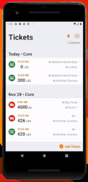

# `react-native-rectangle-scanner`

[](https://www.npmjs.com/package/react-native-rectangle-scanner)  

Live photo rectangle detection library useful for scanning documents. On capture, it returns the URIs for the original and a cropped version of the image allowing you to use the images as you want. You can additionally apply filters to adjust the visibility of text on the image (similar to the iOS document scanner filters).

- Live detection
- Perspective correction and crop of the image
- Filters
- Flash
- Orientation Changes
- Camera permission and capabilities detection
- Fully customizable UI

## Getting started

Install the library using either yarn:

```sh
yarn add react-native-rectangle-scanner
```

or npm:

```sh
npm install react-native-rectangle-scanner --save
```

you will also need to install `react-native-svg`, which is used for drawing the detected rectangle over the camera view.

### iOS Only

CocoaPods on iOS needs this extra step:

```sh
cd ios && pod install && cd ..
```


**NOTE**: you need to be targeting iOS 10 or greater.  Your pod file may need `platform :ios, '10.0'` at the top

### Android Only

If you do not have it already in your project, you must link openCV in your `settings.gradle` file

```java
include ':openCVLibrary310'
project(':openCVLibrary310').projectDir = new File(rootProject.projectDir,'../node_modules/react-native-rectangle-scanner/android/openCVLibrary310')
```

#### In android/app/src/main/AndroidManifest.xml

Add Camera permissions request:

```
<uses-permission android:name="android.permission.CAMERA" />
```

## Usage

This is the most barebones usage of this. It will show a fullscreen camera preview with no controls on it. Calling `this.camera.current.capture()` will trigger a capture and after the image has been captured and processed (cropped, filtered, stored/cached), it will trigger the `onPictureProcessed` callback.


```javascript
import React, { Component, useRef } from "react"
import { View, Image } from "react-native"

import Scanner from "react-native-rectangle-scanner"

class DocumentScanner extends Component {

  handleOnPictureProcessed = ({croppedImage, initialImage}) => {
    this.props.doSomethingWithCroppedImagePath(croppedImage);
    this.props.doSomethingWithOriginalImagePath(initialImage);
  }

  onCapture = () => {
    this.camera.current.capture();
  }

  render() {
    return (
      <Scanner
        onPictureProcessed={this.handleOnPictureProcessed}
        ref={this.camera}
        style={{flex: 1}}
      />
    );
  }
}
```

Above is a very barebones version of the scanner. Check out a full example in [example folder](example/CompleteExample.js). That will handle device specific things, rendering error states, camera controls for different device sizes, mult tasking mode, etc. This is what I would consider the production ready version of using this package (it's actually very similar to the component(s) that we use in production.

## Simulators

This package works on a simulator. Android has a pretty cool VR world that emulates a camera. On iOS the preview will just be a black screen, and the `onDeviceSetup` property will return false for the `hasCamera` attribute so you can show a custom message like "This device doesnt have a camera".

## Properties

| Prop                        | Default |   Type    | Description                                                |
| :-------------------------- | :-----: | :-------: | :--------------------------------------------------------- |
| filterId                    | `none`  | `integer` | The id of the filter to use. [See More](#filters)                  |
| enableTorch                 | `false` |  `bool`   | If the flashlight should be turned on                      |
| capturedQuality             |  `0.5`  |  `float`  | The jpeg quality of the output images                      |
| onTorchChanged              | `null`  |  `func`   | Called when the system changes the flash state |
| onRectangleDetected         | `null`  |  `func`   | Called when the system detects a rectangle on the image, sends the coordinates  |
| onPictureTaken              | `null`  |  `func`   | Called after an image is captured. It hasn't been cached yet but it will send you the URIs of where it will store it  |
| onPictureProcessed          | `null`  |  `func`   | Called after an image was captured and cached. It sends the URIs of where it stored the images.  |
| styles                      | `null`  |  `object` | Styles the camera view (works best on fullscreen/flex: 1). |
| onErrorProcessingImage      | `null`  | `func`    | Called if there was an error capturing the image. Includes a `message` and the paths it was trying to save if the error was failing to save the image. |
| onDeviceSetup               | `null`  | `func`    | Called after the system sets up the camera allowing you to configure the view for different device setups. |
| androidPermission           | `null`  | `object or false`  | ANDROID ONLY: Allows specifying the permission object on android or disabling entirely (pass `false`). |


### onDeviceSetup
This callback is really important. When you show the Scanner component, it will start setting up the camera. The `onDeviceSetup({hasCamera, permissionToUseCamera, flashIsAvailable, previewHeightPercent, previewWidthPercent})` contains all the details you need to preset the camera view.

`hasCamera` will notify you if the device even has a camera. iOS simulators do not have a camera for example. This gives you the chance to hide the camera preview and show an error or something.

`permissionToUseCamera` will tell you if the user has granted permission to use the camera.

`flashIsAvailable` tells you if the device has a flashlight that you can use.

`previewHeightPercent` and `previewWidthPercent` contain percentages of the portrait view that the preview takes up. This is important because on android devices, there are preset preview sizes that may or may not match the screen size. So you can't just show the preview at full screen or the preview will be stretched. See the example on how I handle this.


### Torch
When changing the `enableTorch` property, the system will call the `onTorchChanged({enabled})` callback as well with the new state. This allows you to keep your component state in sync. Natively the torch will get turned off when the component cleans up or after an image is captured. This allows you to update the state.

### Rectangle Detection
Rectangle detection does NOT show up on the UI automatically. You must take the coordinates from the `onRectangleDetected({detectedRectangle})` callback and render a view that displays a rectangle over the camera view. This can be done easily with a simple SVG by importing `RectangleOverlay` from this package and feeding it the detected rectangle object.

Why not just handle in natively? Because it allows much more customization of the rectangle overlay. For example, you could black out the entire image, except where the detected rectangle is. This also lets you control auto capture and UI changes on detection in javascript.

#### Auto Capture
Auto capturing is handled entirely in the `RectangleOverlay` component by simply setting its `allowDetection={true}` and `onDetectedCapture={this.captureImage}` props. See that component for documentation.

#### Focusing
iOS and some android devices support `continuous focus` mode on their cameras. This means we don't need to worry about focusing the camera ever. There is a function you can call on the ref `focus()` which will trigger a refocus on android devices. *This will likely get expanded in the future to support points so you can focus on a specific location.*

### Capturing An Image
To capture an image, you must create a ref to the component. This ref will allow you to call `capture()` which will trigger the capture asynchronously.

Once triggered, it will take the current detected rectangle and crop, apply filters, and transform the image to correct the perspective. It will call `onPictureTaken({croppedImage, initialImage})` containing the URIs of the cropped image and the original image. NOTE: The image still needs to be cached which can take a few ms, so loading the image will not work yet.

The picture will then start to be processed and cached. Once done, it will call `onPictureProcessed({croppedImage, initialImage})` containing the URIs of the images. This is called after the image is cached which means you can load the images into the UI.

NOTE: There is no UI changes when you capture an image. No screen flash, only a camera sound. This is meant so you can design how you want. *The easiest way is to just use an animated view to flash a white screen.* You can import the `FlashAnimation` component to do this if you want.

**NOTE**: captured images are stored in the app's cache directory under the `CACHE_FOLDER_NAME`. This allows you to clear the cached images when you are done. (This is advised although these may get deleted by the system.)

**NOTE**: on iOS, it will try to correct the rotation of the image. If you are in portrait mode, but the phone is rotated to landscape, it will rotate the captured image automatically.

### Filters
Instead of allowing you to customize the contrast, saturation, etc of the image, I prebuilt the filters. This is because the filter controls are massively different between platforms and changing those values results in much different image outputs. Below are the avilable filters. Honestly, the color controls where pretty bad on android, so the best ones for android are probably just using the Color and Black & White instead of showing all 4 (they are only slightly better than Greyscale and the original photo).

| ID | Name          | Default | Description                            | Preview                                    |
| -- | ------------- | ------- | -------------------------------------- | -------------------------------------------|
| 1  | Color         |         | Optimzed for legibility with color.    |            |
| 2  | Black & White |         | Optimized for legibility without color |  |
| 3  | Greyscale     |         | A black & white version of the image   |        |
| 4  | Photo         | YES     | Just the photo                         |            |
